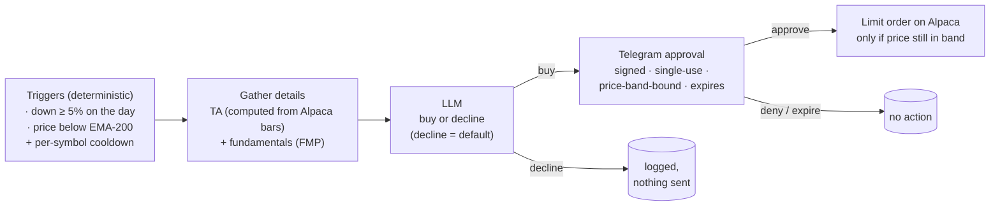

# SmartCapital v1

A deliberately simple, human-approved investing assistant. It watches a
watchlist, and when a predefined condition hits, it gathers the facts, asks an
LLM for a buy/decline call, and — only if the LLM says buy — asks **you** on
Telegram. Nothing is ever bought without your explicit approval.

## The flow



## Components

| File | Job |
|---|---|
| `triggers.py` | The two v1 triggers + TA snapshot, pure functions, thresholds in `config.yaml` |
| `market.py` | Alpaca: bars, latest price, clock, cash |
| `fundamentals.py` | FMP: sector, valuation, recent earnings |
| `analyst.py` | One LLM call → strict-JSON `buy`/`decline` with reasoning + risks |
| `telegram_bot.py` | Approve/Deny to one allowlisted chat; tokens signed, single-use, band-bound; TTL expiry |
| `executor.py` | Pre-submit re-checks, then a limit order (idempotent client order id); tracks to fill |
| `engine.py` | Wires the pipeline; every step persisted |
| `db.py` | SQLite: proposals, cooldowns, kill switch, append-only event log |
| `cli.py` | `run` · `kill` · `unkill` · `status` · `init-db` |

## Built-in safety (small on purpose)

- **Human gate**: every buy needs a tap in your Telegram chat; unanswered
  proposals expire into nothing.
- **Price-band binding**: your approval means "buy near $X". If the price has
  moved outside ±1% by execution time, the proposal is voided, not chased.
- **Limit orders only**, sized at a fixed $ amount, with a cash floor.
- **Cooldown**: a trigger fires once per symbol per 5 days, not every 15 minutes.
- **Kill switch**: `smartcapital kill` stops everything instantly.
- **Paper by default**: `ALPACA_ENV=paper` until you deliberately flip it.

## Setup

```bash
python -m venv .venv && source .venv/bin/activate
pip install -e ".[dev]"
cp .env.example .env               # Alpaca, FMP, Anthropic, Telegram keys
cp config.example.yaml config.yaml # watchlist + thresholds
smartcapital init-db
smartcapital run
```

Telegram setup: create a bot with @BotFather, put its token in `.env`, message
the bot once, then put your chat id in `TELEGRAM_ALLOWED_CHAT_ID` (get it from
`https://api.telegram.org/bot<TOKEN>/getUpdates`).

## Tests

```bash
pytest
```

## Roadmap (kept out of v1 on purpose)

Options-volume trigger · sell/portfolio-review loop · adversarial multi-pass
analysis · exposure/sector limits · approval-fatigue controls · evaluation
scoring vs a no-LLM baseline. A fuller v2 design exploring all of these lives
in git history (`docs/DESIGN.md` before the v1 rewrite).

> **Not investment advice.** Personal tooling; a human approves every action.
