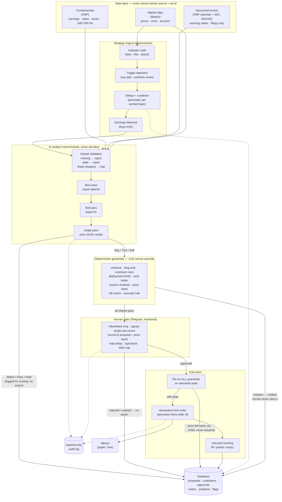
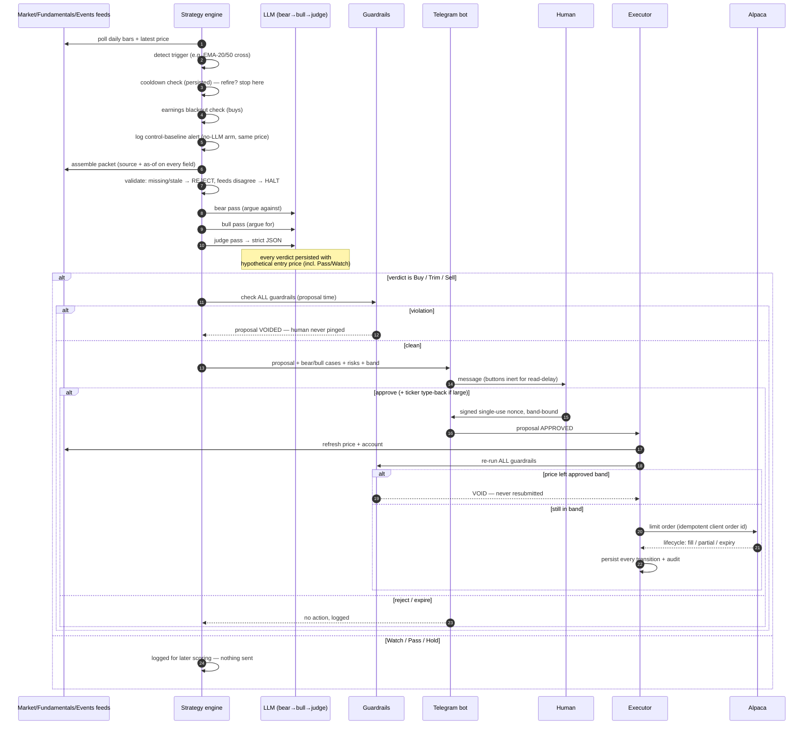
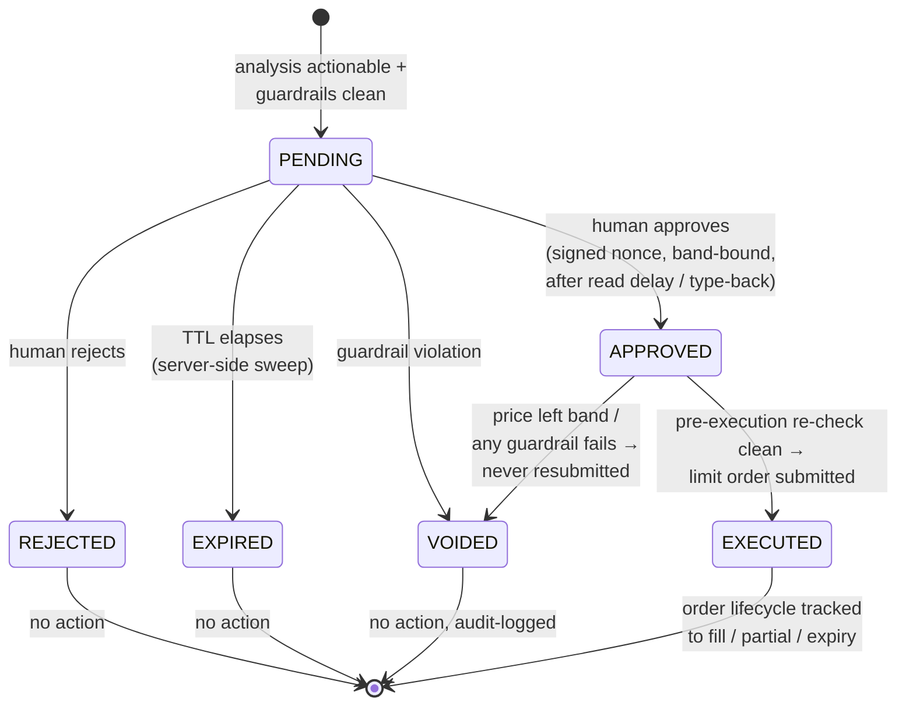
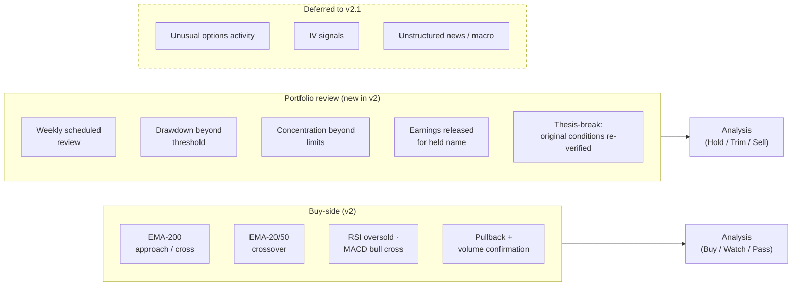
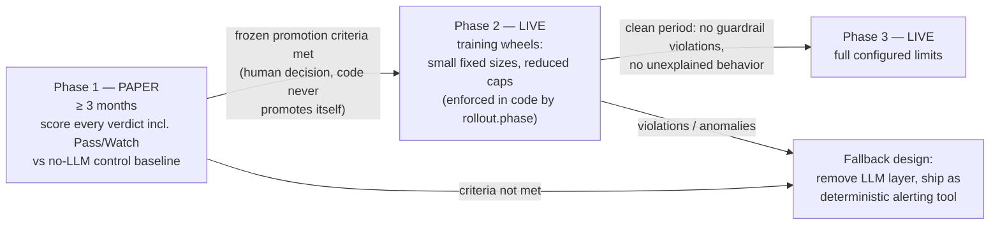

# Architecture Diagrams

## 1. System overview — layered authority

Deterministic code owns monitoring, math, safety, and execution. The LLM owns
analysis and recommendation only. The human owns every decision. Alpaca
executes only approved, price-bounded, idempotent orders.

## 2. End-to-end flow — one trade

## 3. Proposal lifecycle

## 4. Trigger taxonomy

## 5. Evaluation and staged rollout

